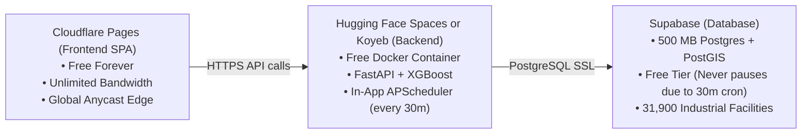

# Option 3: Permanent Free Tier Cloud Deployment Guide ($0 Forever, No Trials)

This guide takes you step-by-step through deploying IGNIS indefinitely on **100% permanent free tiers** with **zero trial clocks**, **near real-time automation**, and **no auto-deletions**.

---

## Architecture Overview



---

## Step 1: Set Up the Free Database (Supabase)

1. **Sign Up**:
   Go to [supabase.com](https://supabase.com) and create a free account.
2. **Create Project**:
   - Project Name: `IGNIS`
   - Database Password: *(Pick a strong password and save it!)*
   - Region: Select a region close to you (e.g., `Mumbai` or `Singapore`).
   - Pricing Plan: **Free** ($0.00/mo, not a trial).
3. **Initialize Schema & PostGIS**:
   - In your Supabase dashboard, click **SQL Editor** on the left menu.
   - Open [database/init.sql](file:///c:/Users/arnav/OneDrive/Desktop/IGNIS/database/init.sql) in your code editor, copy the entire file contents, paste into the Supabase SQL Editor, and click **Run**.
4. **Get Connection String**:
   - Go to **Project Settings** (gear icon) -> **Database**.
   - Under **Connection string**, select **URI** (or under **Connection parameters**, copy `Host`, `Port`, `Database`, `User`, `Password`).
5. **Sync Your Local Data to Supabase**:
   Your local machine already has all 31,900 industrial sites and 12,155 thermal events.
   Run this single command from your project root in PowerShell:
   ```powershell
   .\venv\Scripts\python.exe database/sync_to_supabase.py --target "postgresql://postgres:<YOUR_PASSWORD>@db.<YOUR_PROJECT_REF>.supabase.co:5432/postgres"
   ```
   *(This script will copy all tables, coordinates, clusters, and risk scores to Supabase in ~10 seconds!)*

> [!NOTE]
> **Why Supabase won't pause:** Supabase free tier pauses inactive projects after 7 days. Because the IGNIS background scheduler runs every 30 minutes to fetch and score NASA FIRMS data, it continuously interacts with the database, keeping it permanently active!

---

## Step 2: Deploy Backend & Worker (Hugging Face Spaces or Koyeb)

We configured the FastAPI backend so that by setting `RUN_SCHEDULER_IN_APP=true`, both the **FastAPI API** and the **APScheduler Worker** run together inside a single free container.

### Recommended Host: Hugging Face Spaces (Docker)
- **Specs**: 2 vCPU, 16 GB RAM, 50 GB disk (100% Free Forever, no credit card required).
- **Never Expires**: Not a trial.

#### Instructions:
1. Push your IGNIS code to a GitHub repository (if you haven't already).
2. Go to [huggingface.co/spaces](https://huggingface.co/spaces) and click **Create new Space**.
3. Set:
   - Space Name: `ignis-api`
   - License: `mit` (or choose any)
   - Space SDK: **Docker** -> **Blank**
4. Connect your GitHub repository to this Space, or push your code directly to the Hugging Face Git remote.
5. In your Space -> **Settings** -> **Variables and Secrets**:
   Add the following **Secrets** / **Variables**:
   - `DB_HOST`: `db.<YOUR_PROJECT_REF>.supabase.co`
   - `DB_PORT`: `5432`
   - `DB_NAME`: `postgres`
   - `DB_USER`: `postgres`
   - `DB_PASSWORD`: `<YOUR_SUPABASE_PASSWORD>`
   - `FIRMS_MAP_KEY`: `a202cb6ee349bacce1a87449dd3b7605`
   - `SENTINEL_CLIENT_ID`: `sh-f1cd15c3-bf5b-4b5a-8bae-cb269dda706f`
   - `SENTINEL_CLIENT_SECRET`: `mul3qUz85FWBef6KMWHWSqFQVspL7Dc8`
   - `RUN_SCHEDULER_IN_APP`: `true`
   - `AUTOMATION_INTERVAL_MINUTES`: `30`
   - `CORS_ORIGINS`: `*`
   - `PORT`: `7860`
6. Click **Restart Space**.
7. In ~1 minute, your backend will be live at:
   `https://<username>-ignis-api.hf.space`
   Test it by opening: `https://<username>-ignis-api.hf.space/api/health`

---

## Step 3: Deploy Frontend (Cloudflare Pages)

Cloudflare Pages provides permanent 100% free hosting with unlimited bandwidth, global Anycast CDN, automatic SSL, and zero sleep time.

1. Go to [dash.cloudflare.com](https://dash.cloudflare.com) -> **Workers & Pages** -> **Create application** -> **Pages** -> **Connect to Git**.
2. Select your `IGNIS` GitHub repository.
3. Configure the build settings:
   - **Framework preset**: `Vite`
   - **Root directory**: `frontend`
   - **Build command**: `npm run build`
   - **Build output directory**: `dist`
4. Add Environment Variable:
   - Variable name: `VITE_API_BASE_URL`
   - Value: `https://<username>-ignis-api.hf.space` (your backend URL from Step 2)
5. Click **Save and Deploy**.
6. Cloudflare will build the site in ~30 seconds and give you a permanent `https://ignis-xxx.pages.dev` URL!

---

## Verification Checklist

1. [ ] **Health Endpoint**: `https://<backend-url>/api/health` returns:
   ```json
   {
     "api": "ok",
     "database": "ok",
     "row_counts": {
       "events": 12155,
       "facilities": 31900,
       "clusters": 1832,
       "classified": 12155
     }
   }
   ```
2. [ ] **Live Dashboard**: Open your Cloudflare Pages URL; the map renders active industrial thermal clusters and facilities.
3. [ ] **Near Real-Time**: Every 30 minutes, the background worker automatically ingests newly downlinked NASA VIIRS thermal detections and upserts scored alerts.
