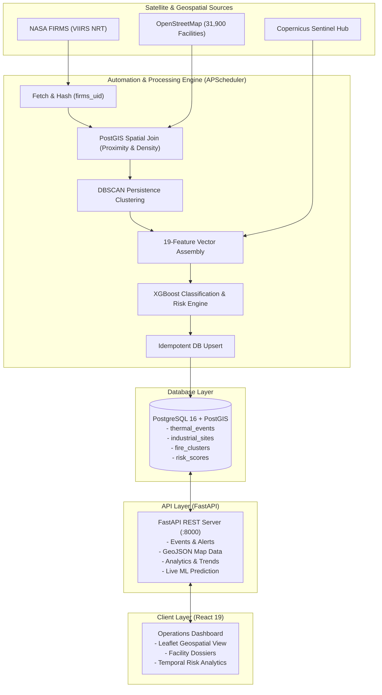

# IGNIS — Industrial Thermal Anomaly Classification & Monitoring System

[](https://fastapi.tiangolo.com)
[](https://react.dev)
[](https://www.postgresql.org)
[](https://xgboost.readthedocs.io)
[](https://vitejs.dev)
[](https://opensource.org/licenses/MIT)

> **IGNIS** is an AI-powered, near-real-time satellite monitoring and situational awareness platform designed to detect, classify, and evaluate the risk of **industrial thermal anomalies** (refinery flare-ups, plant explosions, petrochemical hazards, and factory fires) and distinguish them from seasonal agricultural burning and natural wildfires.

---

## Table of Contents
1. [Project Overview](#project-overview)
2. [Key Capabilities](#key-capabilities)
3. [System Architecture](#system-architecture)
4. [Repository Structure](#repository-structure)
5. [Machine Learning & Risk Engine](#machine-learning--risk-engine)
6. [API Reference](#api-reference)
7. [Local Quick Start](#local-quick-start)
8. [Production Deployment Architecture](#production-deployment-architecture)
9. [Environment Variables Reference](#environment-variables-reference)
10. [Project Contributors](#project-contributors)
11. [License & Acknowledgements](#license--acknowledgements)

---

## Project Overview

Thermal sensors on Earth-observing satellites detect thousands of active heat anomalies every day. However, first responders, environmental authorities, and industrial operators face a severe **signal-to-noise challenge**:
- Is an anomaly a routine gas flare at a petroleum refinery?
- Is it a high-risk structural blaze or tank farm explosion?
- Or is it an agricultural stubble fire or natural forest fire nearby?

**IGNIS** solves this by fusing satellite radiometric data, open spatial infrastructure registries, spatio-temporal clustering, and calibrated machine learning models to deliver instant risk intelligence and automated alerts.

---

## Key Capabilities

- **Near-Real-Time Satellite Ingestion**: Continuously polls NASA FIRMS (VIIRS SNPP NRT) and downlinks active fire pixels with radiometric brightness temperatures (I-4, I-5) and Fire Radiative Power (FRP).
- **Industrial Infrastructure Context**: Pre-loaded with over **31,900 OpenStreetMap industrial facilities** across India (refineries, power plants, chemical works, pipeline junctions, petroleum wells).
- **Spatio-Temporal DBSCAN Clustering**: Evaluates thermal persistence over rolling windows to identify stationary, recurrent thermal sources vs. mobile fire fronts.
- **Multimodal Feature Engineering**: Automatically extracts 19 features including proximity to infrastructure, density of industrial sites, day/night satellite passes, cluster duration, and spectral context.
- **AI Classification & Calibrated Risk Scoring**: XGBoost classifier categorizes anomalies into discrete hazard classes with an integrated probability calibration model outputting risk scores ($0.0 - 10.0$) and risk tiers (**High**, **Medium**, **Low**).
- **Interactive Operations Command Center**: High-performance React 19 web dashboard with interactive Leaflet GIS maps, filterable alert feeds, facility inspection dossiers, and temporal trend analytics.

---

## System Architecture



---

## Repository Structure

```
IGNIS/
├── automation/                 # Near-real-time ingestion and automated scoring pipeline
│   ├── steps/                  # Discrete pipeline execution stages
│   │   ├── fetch_firms.py      # NASA FIRMS API rolling ingestion
│   │   ├── dedupe_and_insert.py# Hash-based deterministic deduplication
│   │   ├── facility_join.py    # PostGIS spatial joins with industrial facilities
│   │   ├── cluster_update.py   # Rolling DBSCAN persistence clustering
│   │   ├── sentinel_context.py # Spectral imagery context provider
│   │   ├── feature_builder.py  # Assembles 19-column ML feature vector
│   │   ├── scorer.py           # Packaged XGBoost inference engine
│   │   ├── risk_engine.py      # Calibrated risk tier and score evaluator
│   │   └── db_writer.py        # Idempotent database upserting
│   ├── run_pipeline.py         # Full standalone pipeline runner
│   ├── scheduler.py            # 24/7 background scheduler (APScheduler)
│   └── one_time_backfill.py    # Historical dataset backfill utility
│
├── backend/                    # High-throughput REST API (FastAPI)
│   ├── app/
│   │   ├── config.py           # Environment and path settings
│   │   ├── database.py         # SQLAlchemy engine and connection pool
│   │   ├── main.py             # FastAPI application entrypoint & in-app scheduler
│   │   ├── ml/                 # In-memory ML model loaders and predictors
│   │   ├── models/             # SQLAlchemy ORM declarative models
│   │   ├── repositories/       # Database access layers
│   │   ├── routers/            # API route controllers (events, map, alerts, analytics)
│   │   └── schemas/            # Pydantic request/response models
│   ├── requirements.txt        # Backend Python dependencies
│   └── run.py                  # Local backend entrypoint
│
├── frontend/                   # Operations Web Dashboard (React 19 + Vite)
│   ├── src/
│   │   ├── api/                # Axios API clients with resilient offline fallback
│   │   ├── components/         # Reusable UI components (NavBar, FilterBar, Map)
│   │   ├── constants/          # Classification labels, color tokens, and tiers
│   │   ├── data/               # High-fidelity offline fallback mock data
│   │   ├── pages/              # Page views (Dashboard, Map, Analytics, Facilities, Alerts)
│   │   ├── App.jsx             # React router & dynamic tab title management
│   │   └── index.css           # Modern Enterprise Navy design system
│   ├── package.json            # Node.js dependencies
│   ├── vercel.json             # Vercel Single-Page Application routing config
│   └── vite.config.js          # Vite configuration
│
├── database/                   # Spatial database migrations and seeders
│   ├── init.sql                # Complete PostGIS schema, indexes, and constraints
│   ├── seed_initial_data.py    # Idempotent CSV/JSON data seeder
│   └── sync_to_supabase.py     # Bulk network migrator from local DB to Supabase
│
├── ml/                         # Machine learning model artifacts & training
│   ├── models/
│   │   ├── xgb_fire_classifier.json     # Trained XGBoost classifier
│   │   ├── feature_config.json          # 19-feature definitions & categorical encodings
│   │   └── calibrated_risk_model.joblib # Calibrated probability model
│   └── training/
│       └── label_mapping.json           # Categorical class index map
│
├── data/                       # Curated datasets (OSM raw, historical events, features)
│   ├── osm_raw.json            # 31,900 OpenStreetMap industrial facility elements
│   ├── firms_clean.csv         # Cleaned thermal detections dataset
│   └── risk_scores.csv         # Precomputed baseline risk scores
│
├── Dockerfile                  # Universal container for cloud platforms (Render, Koyeb, HF)
├── Dockerfile.backend          # Dedicated backend + worker container
├── Dockerfile.frontend         # Multi-stage Vite + Nginx container
├── docker-compose.yml          # Full-stack local / VPS orchestration
├── render.yaml                 # 1-Click Render production deployment blueprint
├── start_ignis.py              # Master local runner (Backend + Worker + Frontend)
└── DEPLOYMENT.md               # Detailed multi-cloud deployment guide
```

---

## Machine Learning & Risk Engine

IGNIS utilizes a multi-stage machine learning architecture to evaluate whether a satellite heat signature represents a dangerous industrial emergency.

### 1. Classification Model (`xgb_fire_classifier.json`)
An **XGBoost Classifier** trained on 19 multi-modal spatial, temporal, and radiometric features:
- **Radiometric**: Brightness temperatures (`bright_ti4`, `bright_ti5`), Temperature differential (`bright_ti4 - bright_ti5`), Fire Radiative Power (`frp`), FRP-to-temperature ratio.
- **Temporal & Solar**: Solar cycle (`daynight`), Detection time, Seasonal calendar day.
- **Infrastructure Proximity**: Distance to nearest industrial site, Facility type (refinery, power plant, chemical works), Industrial sites within 1km / 5km radius.
- **Persistence & Clustering**: Cluster duration (active days), Total detections count, Cluster mean/max FRP, Persistence recurrence index.

**Classification Output Categories**:
1. `Industrial Fire` *(Critical Emergency)*
2. `Persistent Industrial Thermal Source` *(Flaring / Smelting / Kiln)*
3. `Wildfire / Natural Fire` *(Vegetation / Forest)*
4. `Other / Unknown`

### 2. Risk Calibration Engine (`calibrated_risk_model.joblib`)
Raw model probabilities are mapped through a calibrated risk engine that calculates:
- **Risk Score**: A normalized continuous metric from `0.0` to `10.0`.
- **Risk Tier**:
  - `HIGH`: Confirmed industrial facility fires or runaway thermal spikes requiring immediate dispatch.
  - `MEDIUM`: Anomalous flaring, elevated persistent heat sources, or fires in high facility density corridors.
  - `LOW`: Controlled flaring, minor background heat, or isolated agricultural clearing.

---

## API Reference

The backend provides a comprehensive, interactive OpenAPI specification accessible at `/docs` when running.

| Method | Endpoint | Description |
| :--- | :--- | :--- |
| `GET` | `/api/health` | Healthcheck returning DB connection and live row counts |
| `GET` | `/api/dashboard-summary` | High-level metrics (total active, critical alerts, facilities affected) |
| `GET` | `/api/events` | Filterable, paginated thermal events (by tier, class, date) |
| `GET` | `/api/events/{id}` | Detailed event dossier with spatial context and nearest facilities |
| `GET` | `/api/map-data` | High-performance GeoJSON stream for Leaflet bounding box views |
| `GET` | `/api/alerts` | Active high-priority industrial alerts stream |
| `GET` | `/api/analytics/timeline` | Daily time-series breakdown of detections by class |
| `GET` | `/api/analytics/by-facility-type` | Event frequency across infrastructure types |
| `GET` | `/api/analytics/distance-profile` | Anomaly distribution segmented by distance brackets |
| `GET` | `/api/facilities` | Searchable directory of industrial sites |
| `GET` | `/api/facilities/{id}` | Facility profile with historical thermal signature log |
| `POST`| `/api/predict` | Live inference endpoint: classify and score arbitrary coordinates |

---

## Local Quick Start

### Prerequisites
- Python 3.11+
- Node.js 18+
- PostgreSQL 16+ with PostGIS extension installed

### 1. Clone the Repository
```bash
git clone https://github.com/dubey-arnav/IGNIS.git
cd IGNIS
```

### 2. Configure Environment
Copy the sample environment file to `.env`:
```bash
cp .env.example .env
```
Fill in your database credentials and NASA FIRMS API key.

### 3. Initialize Database
Run the schema initialization and data seeder:
```bash
# In PostgreSQL
psql -U postgres -d IGNIS -f database/init.sql

# Seed 31,900 industrial facilities and historical scores
python database/seed_initial_data.py
```

### 4. Run Everything with One Command
Execute the master local runner:
```bash
python start_ignis.py
```
This concurrently starts:
- **FastAPI Backend**: `http://localhost:8000` (Docs: `http://localhost:8000/docs`)
- **Automation Pipeline**: Polling NASA FIRMS every 30 minutes in the background
- **React Frontend**: `http://localhost` (or `http://localhost:5173`)

---

## Production Deployment Architecture

IGNIS is designed to run **indefinitely** in **near-real-time** on **100% permanent free tiers** with **zero expiring trials**:

| Component | Platform | Configuration & Role |
| :--- | :--- | :--- |
| **Database** | **Supabase** | Managed PostgreSQL 16 + PostGIS hosting 31,900 industrial sites and 12,000+ thermal events. Kept permanently awake by the 30-min pipeline queries. |
| **Backend & Worker** | **Render** | FastAPI and the in-app APScheduler worker running together in a Python web service, kept 24/7 active via a free 10-minute HTTP ping from cron-job.org. |
| **Frontend UI** | **Vercel / Cloudflare Pages** | React 19 Single Page Application deployed to global Anycast edge networks with automatic SSL, zero cold starts, and continuous Git deployment. |

For detailed step-by-step instructions, see [DEPLOYMENT.md](DEPLOYMENT.md) and [DEPLOY_OPTION_3.md](DEPLOY_OPTION_3.md).

---

## Environment Variables Reference

| Variable | Description | Default / Example |
| :--- | :--- | :--- |
| `DB_HOST` | Database host address | `localhost` or Supabase pooler host |
| `DB_PORT` | Database port | `5432` |
| `DB_NAME` | Database name | `IGNIS` or `postgres` |
| `DB_USER` | Database username | `postgres` |
| `DB_PASSWORD` | Database password | — |
| `FIRMS_MAP_KEY` | NASA FIRMS MAP API key | NASA Earthdata MAP Key |
| `SENTINEL_CLIENT_ID` | Copernicus / Sentinel Hub Client ID | — |
| `SENTINEL_CLIENT_SECRET`| Copernicus / Sentinel Hub Secret | — |
| `RUN_SCHEDULER_IN_APP` | Run background worker inside FastAPI | `true` |
| `AUTOMATION_INTERVAL_MINUTES` | Automation pipeline run interval | `30` |
| `AUTOMATION_LOOKBACK_DAYS` | Days of rolling satellite data to fetch | `2` |
| `FIRMS_BBOX` | Geographic bounding box `[W,S,E,N]` | `68,6,97,37` (India) |
| `CORS_ORIGINS` | Permitted frontend origins | `*` |
| `VITE_API_BASE_URL` | Frontend API target | `https://your-backend.onrender.com` |

---

## Project Contributors

* **Arnav Dubey** ([@dubey-arnav](https://github.com/dubey-arnav)) — *Lead Developer, Full-Stack Architecture, Pipeline Engineering & Deployment*
* **Kush Gandhi** ([@kushgandhi1609](https://github.com/kushgandhi1609)) — *Contributor, Data Ingestion, Machine Learning & Feature Engineering*

---

## License & Acknowledgements

This project is licensed under the [MIT License](LICENSE).

### Data & Service Acknowledgements
- **NASA FIRMS**: Near-Real-Time (NRT) Active Fire Data from VIIRS (S-NPP / NOAA-20).
- **OpenStreetMap Contributors**: Global open geospatial infrastructure datasets.
- **Copernicus / Sentinel Hub**: Multi-spectral imagery context providers.
